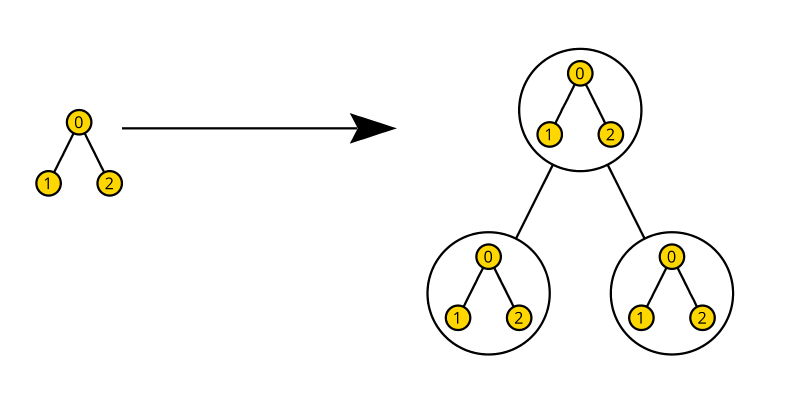
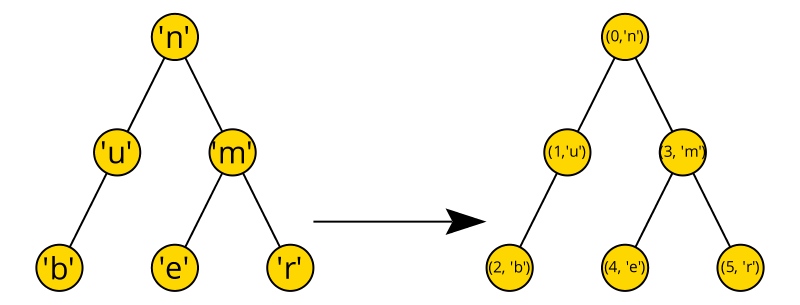

# Assignment 1

**Due Monday, April 24th, 11:59PM**

In this assignment, you will get some practice writing simple functions in OCaml that manipulate lists (Part 1) and trees (Part 2).


**Important Notes**:

* Before starting this homework, make sure you have installed `opam` and OCaml following the instructions [here](https://github.com/fredfeng/CS160/blob/main/sections/sec01/sec1.org).

* Next install the dependencies by doing
  ```sh
  opam install utop dune alcotest ppx_deriving ocamlformat
  ```
  
	 If you don't want to install things globally (it should be easier for our purposes, because you only need to do this once, but for a real project, it's bad practice), see: https://ocamlverse.net/content/quickstart_ocaml_project_dune.html

* You are **not** allowed to use any built-in OCaml functions, except for `List.map`, for any of the problems. If you do, you will not be awarded any points. Note that datatype constructors (e.g., `[]`, `::`, `None`, and `Some`) and patterns (e.g., `| hd::tl -> ...` in a pattern-match) are not considered as functions, so you may freely use them.

* Because you are learning a new programming language and using features that may be unfamiliar to you, we recommend that you start early on this homework.

* The problems were designed so that you'll only need to write 5-15 lines of code for each one.

* The `tree.ml` and `hw1_sig.ml` contains the type definitions and function signatures for this assignment. The only file you need to modify is `hw1.ml`. We have marked places where you need to write your own code with `todo ()`. Simply replace them with your own code.

* For each problem, the provided template always starts with the `let` keyword. However, if you think the problem can't be solved without recursion, you may change `let` into `let rec`. You may define helper functions if you find them helpful.

* Make sure the types of your functions exactly match the  signatures defined in `hw1_sig.ml`. The OCaml interpreter will automatically verify this by checking that your `Listy` (resp. `Treey`) module satisfies our `LISTY` (resp. `TREEY`) signature, and will throw an error if there is a mismatch.

* You can test your code by running `dune utop . --` to compile your code and load it into a REPL. Note that you have to manually import the modules by doing
    ```
    open Hw1;;
    open Listy;;
    open Treey;;
    ```
    after which you can manually enter some test cases. If you are willing to put in some additional work, you could define unit tests in the [test file]((./test/hw1_test.ml)) we provided, which contains the examples used in this write-up. You can add your own test cases there, and do `dune test` to run all unit tests.

* For some of the problems, you will find yourself having to write *nested* pattern matching. In those scenarios, it is always a good practice to enclose the inner match with parentheses:
    ```ocaml
    match ... with
    | <case_1> -> (
        match ... with
        | <case_1a> -> ...
        | <case_1b> -> ...)
    | <case_2> -> ...
    ```
    If you don't do this, the OCaml parser can't know for sure whether `<case_2>` belongs to the inner match or the outer match, because indentations don't matter in OCaml. Thus, the interpreter will default to the former option, often leading to unhelpful type errors.

* You can run `dune fmt` to have your code automatically beautified.

* If you are struggling, please ask questions on Slack or come to office hours. In particular, let us know if you need additional practice with recursion.


## Part 1: Listy (17 pts)

1. (2 pts) `val prepend : 'a -> 'a list -> 'a list` takes an element and a list, and prepends that element to the list. For example, `prepend 1 [2; 3]` evaluates to `[1; 2; 3]`.

2. (3 pts) `val append : 'a -> 'a list -> 'a list` takes an element and a list, and appends that element to the end of the list. For example, `append 1 [2; 3]` evaluates to `[2; 3; 1]`.

3. (3 pts) `val cat : 'a list -> 'a list -> 'a list` concatenates two lists. For example, `cat [1; 2] [3; 4]` evaluates to `[1; 2; 3; 4]`.

4. (4 pts) `val zip : 'a list -> 'b list -> ('a * 'b) list option` takes two lists and "zips" them up in a pairwise fashion. In case the lists have different lengths, `zip` returns `None`. For example, `zip [1; 2] ["a"; "b"]` evaluates to `Some ([(1, "a"); (2, "b")])`, while `zip [1] ["a"; "b"]` evaluates to `None`.

5. (5 pts) `permute : 'a list -> 'a list list` takes a list representing a set, and returns all permutations of the set. You may assume the input list contains distinct elements. The order of the permutations do not matter. For example, `permute [1; 2; 3]` evaluates to `[ [1; 2; 3]; [1; 3; 2]; [2; 1; 3]; [2; 3; 1]; [3; 1; 2]; [3; 2; 1] ]`.

## Part 2: Treey (15 pts)

A binary tree is either a leaf, or a node that has some data, a left child, and a right child:
```ocaml
type 'a tree = Leaf | Node of 'a * 'a tree * 'a tree
```

The following functions are provdied to help you construct trees:
```ocaml
(* Create a new leaf *)
let leaf = Leaf

(* Create a new node with data, left child, and right child *)
let node x l r = Node (x, l, r)

(* Create a terminal node with data and no child *)
let node' x = node x leaf leaf
```

You will implement the following functions:

1. (2 pts) `val skeleton : 'a tree -> unit tree` takes a tree, and returns its "skeleton" by replacing all data with the unit value `()`. For example,

	
   
    where `X` represents a leaf node.
	

2. (3 pts) `val selfie : 'a tree -> 'a tree tree` takes a selfie of the input tree by replacing each piece of data with the original tree itself. For example:
	
   

3. (5 pts) `val timestamp : 'a tree -> (int * 'a) tree` takes a tree and numbers each node with an integer timestamp that corresponds to when the node is first visited by depth-first search. Timestamps start at `0`. For example,
   
   
    (Leaf nodes are not drawn.)

4. (3 pts) A `tree_nfa` -- defined as
    ```ocaml
    type tree_nfa = unit tree
    ``` 
    -- represents a [non-deterministic finite state automaton (NFA)](https://en.wikipedia.org/wiki/Nondeterministic_finite_automaton) whose transition relation forms a tree. We interpret a `tree_nfa` as an NFA as follows:
   
    - The alphabet is binary:
        ```ocaml
        type alphabet = O | I
        ```

    - A word is a finite sequence of characters drawn from the alphabet:
        ```ocaml
        type word = alphabet list
        ```

    - Each node corresponds to an NFA state:
        
        - The root node represents the initial state.

        - Leaf nodes represent rejecting state.
        
        - Non-leaf nodes represent accepting state.

    - A left branch corresponds to an edge labeled with `O`, while a right branch 
        corresponds to an edge labeled with `I`.

    Here is an example of a `tree_nfa`:
    
	
	
	
   This NFA accepts $\{\varepsilon, O, I, II\}$, but rejects everything else.
   
   Here's the NFA parsing "II" - a valid input. On this input, the NFA doesn't reach the leaf node when traversing, so we accept:
	
	
	
	
   Here's the NFA parsing "oo" - an *invalid* input.  On this input, we reject because it reaches the leaf, X:
	
	

   

   Implement `val accepts : word -> tree_nfa -> bool` that determines whether a `tree_nfa` accepts the given `word`.
   


5. (2 pts) A [trie](https://en.wikipedia.org/wiki/Trie) is like a `tree_nfa`, except that each "state" now optionally holds some data:
    ```ocaml
    type 'a trie = 'a option tree
    ```
    It is used as a dictionary to map keys of type `word` to values of type `'a`. Intuitively, the data associated with key `k` will be on the same node that accepts `k` in the corresponding `tree_nfa`.

    For example, the following is an `int trie`:
    
	
	
   where it maps
   ```
     epsilon         |-> Some 3
     O               |-> Some 5
     II              |-> Some 4
     everything else |-> None
    ```
    Tries are also called *prefix trees*, since for any node N whose parent is M:
    ```
    N's key = 
      if N is the left child then
        M's key appended with O
      else
        M's key appended with I
    ```
    Implement `val lookup : word -> 'a trie -> 'a option` that looks up the value associated with the given key. If the key is not found or there is no associated value, return `None`. Otherwise, return `Some v` where `v` is the value.

6. (5 pts) Implement `val insert : word -> 'a -> 'a trie -> 'a trie` that takes a key, a value, and a trie, and inserts the value onto trie, replacing the old value if any. For example, if the input trie `t` is
	
	
	
    then `insert [O;O] 6 t` returns the new trie:
	
	

## Submission

Turn in `hw1.ml` on Gradescope. You do not need to turn in any other file. Before the submission portal closes, the autograder will only display how many *public* test cases (i.e. those in the [test](./test/) directory) that your solutions pass. The autograder will run the full test suite once the submission portal has closed.